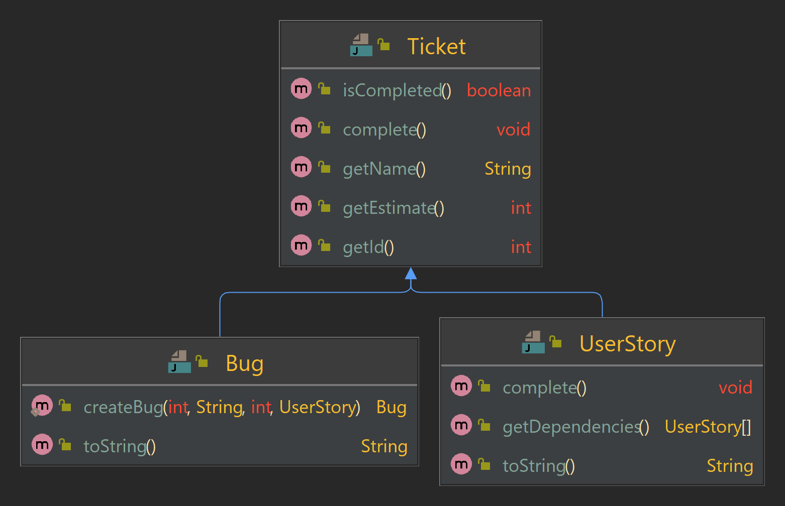

# Sprint Planning

The purpose of this exercise is to train basic inheritance features.

Estimated workload of this exercise is _120 min_.

### Description

In this exercise we are going to manage business logic of planning a sprint.
A sprint is the basic unit of software development in SCRUM.
Sprints are timeboxed. Time capacity of a sprint is agreed while planning.
Then we consdier a sprint to be filled with some tasks.

We consider a task to be implemented with general-purpose `Ticket` class.
But we also consider a sprint to accept only subtypes of the `Ticket` class: `Bug` and `UserStory`.

Here is a diagram depicting the public interface of these classes and their relations:

Here are API details:
- [Ticket](src/main/java/com/epam/rd/autotasks/sprintplanning/tickets/Ticket.java)\
  Every ticket has an id, a name and an estimate of hours to complete it.
  One provides them via the constructor of the `Ticket` class.
  Also, a ticket may be completed or not. When a ticket is created, it is not completed.
  - `getId()` - Returns the id of the ticket.
  - `getName()`  - Returns the name of the ticket.
  - `getEstimate()` - Returns the estimate of the ticket.
  - `isCompleted()` - Returns `true` if the ticket is completed, `false` otherwise.
  - `complete()` - Sets the ticket to completed state. 
- [UserStory](src/main/java/com/epam/rd/autotasks/sprintplanning/tickets/UserStory.java)\
  We consider a user story to be a ticket that may contain some dependencies.
  A dependency is another user story that must be completed first to allow the dependent user story to complete.
  One provides dependencies of the UserStory via the constructor of the `UserStory` class.
  - `complete()` - Like the `Ticket#complete()` method, this sets the ticket to completed state.
  The difference is that the user story may not be completed if its dependencies are not completed yet.  
  - `getDependencies()` - Returns a defensive copy of dependencies array.
  - `toString()` - Returns a String representing this user story, using its id and name. 
  Example: "\[US 1\] User Registration Entity"
- [Bug](src/main/java/com/epam/rd/autotasks/sprintplanning/tickets/Bug.java)\
  We consider a bug to be a ticket, that is related to some completed user story.
  Bugs may not exists by their on, without a related user story.
  - `createBug(int id, String name, int estimate, UserStory userStory)` - A static method to create a Bug instance.\
  Returns `null` if the related user story is `null` or is not completed. Otherwise, returns a created Bug instance.
  - `toString()` - Returns a String representing this bug, using its id, name and the name of the related user story.\
  Example: with id = 2, name = "Add password repeat" and the related user story name = "Registration Form" 
  the resulting string would be "\[Bug 2\] Registration Form: Add password repeat"
- [Sprint](src/main/java/com/epam/rd/autotasks/sprintplanning/Sprint.java)\
  Sprints has the time capacity and the tickets limit, specified via constructor.
  It is not allowed for a Sprint to contain tickets with total estimate greater than time capacity.
  It is not allowed for a Sprint to contain total amount of tickets greater than tickets limit.\
  We consider a sprint to accept tickets via `add*` methods.
  That methods return `true` when an input ticket was accepted and `false` otherwise.
  Note that we consider a sprint to not accept:
  1. `null` values,
  2. tickets, that are already completed
  3. tickets, that has an estimate value that will lead to capacity overflow if added
  4. any ticket, if the sprint ticket limit is reached.
  - `addUserStory(UserStory userStory)` - accepts a userStory, if it is not `null`, not completed
  and its uncompleted dependencies are already accepted to the sprint.
  Returns `true` if the user story is accepted, `false` otherwise.
  - `addBug(Bug bugReport)` - accepts a bug, if it is not `null` and not completed.
  Returns `true` if the bug is accepted, `false` otherwise.
  - `getTickets()` - Returns a defensive copy of the array of the sprint tickets.
  Make sure the order of tickets is as they were accepted to the sprint.
  - `getTotalEstimate()` - Returns the sum of estimates of all the tickets accepted to the sprint.
    

**Important restriction:** Note that in this exercise you **may not** use *Collections* and *Streams*.

### Examples

See usage examples in tests inside [src/test/java](src/test/java).

### References
Wikipedia on the Scrum Sprint: [https://en.wikipedia.org/wiki/Scrum_(software_development)#Sprint](https://en.wikipedia.org/wiki/Scrum_(software_development)#Sprint)
